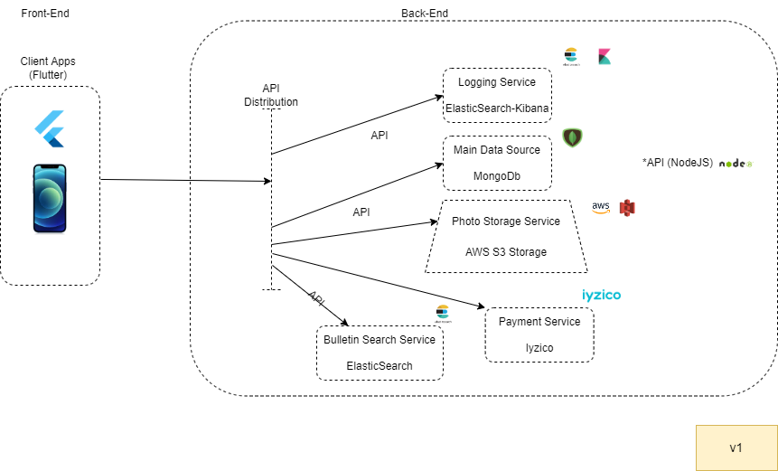

# Dikimall Sample Code

Bu repo geliştirdiğim startup projesinin örnek amaçlı kodlarını içermektedir.Projenin tüm kodları ticari kaygılardan ötürü private repoda tutulmaktadır.

Bu uygulama Flutter Frameworku ile yapılmıştır.Uygulamada MVVM yapısı kullanılmıştır.

Back-end tarafında ise MongoDb,NodeJS,ElasticSearch,AWS S3,Iyzico kullanılmıştır.

Gizlilik gerekçesiyle back-end reposunu açık kaynak koda aktarılmamıştır.

-Uygulamanın demo videosu için https://www.youtube.com/watch?v=mfDzfD6062s

-Uygulama Mimarisi 

-Ekran Görüntüleri

